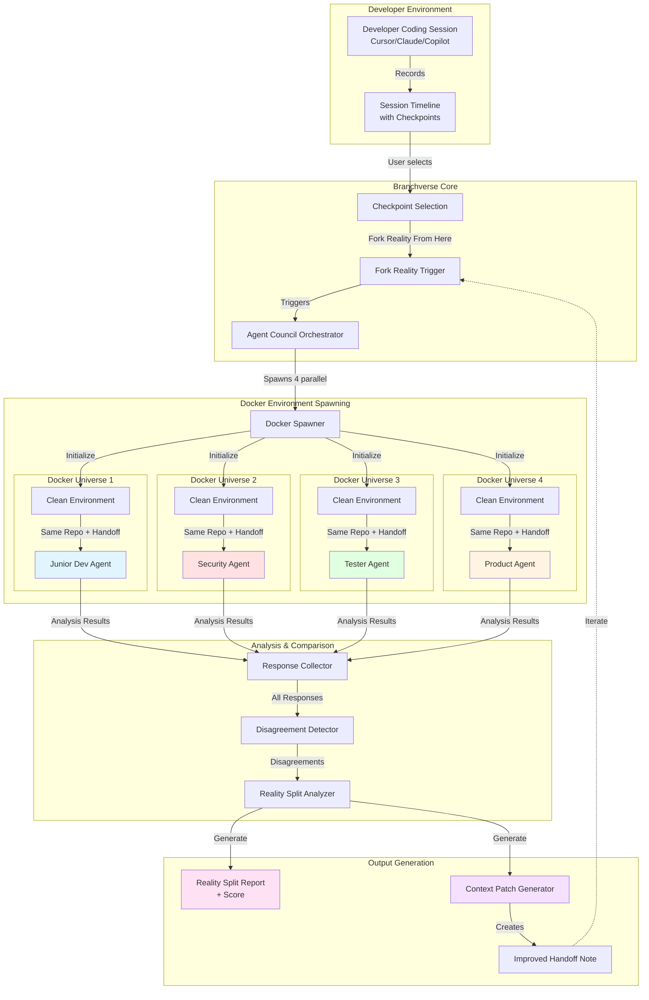

# Agent Council Architecture

## System Overview



## Component Details

### 1. Input Layer
**Components:**
- Developer coding session (any IDE with AI assistance)
- Session timeline recorder
- Checkpoint system

**Data:**
- Repository state at checkpoint
- Handoff note
- File changes
- Task description

---

### 2. Orchestration Layer
**Components:**
- Checkpoint selector
- Fork Reality trigger
- Agent Council Orchestrator

**Responsibilities:**
- Manage Docker environment lifecycle
- Coordinate parallel agent execution
- Distribute identical inputs to all agents

---

### 3. Agent Execution Layer (4 Parallel Docker Universes)

Each universe contains:
```
┌─────────────────────────────────────┐
│  Clean Docker Environment           │
├─────────────────────────────────────┤
│  • Same repo state                  │
│  • Same checkpoint                  │
│  • Same handoff note                │
│  • No local files                   │
│  • No chat memory (unless imported) │
│  • Isolated file system             │
└─────────────────────────────────────┘
```

#### Agent Roles & Evaluation Criteria

| Agent | Primary Question | Checks |
|-------|-----------------|--------|
| **Junior Dev** | "Can a newer developer understand where to start?" | • Important files<br/>• Next steps<br/>• Confusing areas<br/>• Missing context |
| **Security** | "Are there hidden security risks?" | • Auth logic<br/>• Secrets exposure<br/>• Permissions<br/>• Unsafe defaults<br/>• Missing validation |
| **Tester** | "Are claims backed by tests?" | • Test execution<br/>• Test file changes<br/>• Edge case coverage<br/>• Claim verification |
| **Product** | "Does it match user intent?" | • User flow gaps<br/>• Half-finished features<br/>• Frontend/backend alignment<br/>• Usability |

---

### 4. Comparison & Analysis Layer

**Disagreement Detection:**
```javascript
const disagreementAreas = {
  whatIsDone: {
    junior: "auth is complete",
    tester: "tests are missing"
  },
  whereToStart: {
    junior: "frontend/LoginForm.tsx",
    security: "backend/auth/tokenService.ts"
  },
  risks: {
    security: "refresh-token reuse not handled",
    product: "logout flow incomplete"
  },
  canItRun: {
    tester: "Cannot run - .env.example incomplete",
    junior: "Runs locally"
  }
}
```

**Reality Split Score Calculation:**
- Agreement rate across agents
- Severity of disagreements
- Critical gaps identified
- Context portability metrics

---

### 5. Output Generation Layer

#### Reality Split Report
```
Reality Split Score: 82% unstable

The handoff is not portable. The Junior Agent thought logout
was complete, the Product Agent found no frontend logout flow,
the Tester Agent could not run tests because JWT_REFRESH_SECRET
was missing, and the Security Agent found refresh-token reuse
was not handled.

Key Disagreements:
• What is complete: 3/4 agents disagree
• Where to start: 4/4 different entry points
• Security risks: 2 critical issues only found by Security Agent
• Test coverage: Claims don't match reality
```

#### Context Patch
```
Refresh-token auth is partially implemented. Backend login
and refresh routes exist. Refresh tokens are stored in
HttpOnly cookies, not localStorage. JWT_REFRESH_SECRET must
be added to .env.example. Frontend logout state reset is
not complete. Next developer should start with
SessionProvider.tsx, then add tests for expired, revoked,
and reused refresh tokens.
```

---

### 6. Iteration Loop

```
Before Patch:  Reality Split Score: 82% unstable
After Patch:   Reality Split Score: 21% unstable
```

User can re-run Agent Council with improved handoff to validate improvement.

---

## Data Flow Diagram

```
┌──────────────┐
│ Coding       │
│ Session      │
└──────┬───────┘
       │
       ▼
┌──────────────┐
│ Checkpoint + │
│ Handoff Note │
└──────┬───────┘
       │
       ▼
┌──────────────┐      ┌─────────────────────────────────────┐
│ Fork Reality │─────▶│ Spawn 4 Docker Environments         │
└──────────────┘      └─────────────────────────────────────┘
                                     │
                      ┌──────────────┼──────────────┐
                      ▼              ▼              ▼
              ┌──────────┐   ┌──────────┐   ┌──────────┐
              │ Junior   │   │ Security │   │ Tester   │ ...
              │ Analysis │   │ Analysis │   │ Analysis │
              └─────┬────┘   └─────┬────┘   └─────┬────┘
                    │              │              │
                    └──────────────┼──────────────┘
                                   ▼
                         ┌─────────────────┐
                         │ Compare Results │
                         └────────┬────────┘
                                  │
                    ┌─────────────┴─────────────┐
                    ▼                           ▼
          ┌──────────────────┐        ┌──────────────────┐
          │ Reality Split    │        │ Context Patch    │
          │ Report + Score   │        │ (Fixed Handoff)  │
          └──────────────────┘        └────────┬─────────┘
                                               │
                                               ▼
                                        Re-run Council ──┐
                                               ▲         │
                                               └─────────┘
```

---

## Technology Stack (Proposed)

### Container Orchestration
- Docker Engine
- Docker Compose (for multi-container coordination)
- Container resource limits & isolation

### Agent Framework
- LLM API (Claude, GPT-4, etc.)
- Agent prompt templates per role
- Structured output parsing

### Analysis Engine
- Disagreement detection algorithms
- Natural language comparison
- Scoring heuristics

### Storage
- Session timeline database
- Checkpoint snapshots
- Agent response cache
- Report history

---

## Key Differentiators

### vs. Traditional Code Review
- **Traditional**: One perspective, human or AI
- **Agent Council**: 4 simultaneous perspectives in isolated environments

### vs. Software Factory (8090)
- **Software Factory**: Orchestrates entire SDLC (plan → build → test → ship)
- **Agent Council**: Tests context portability after work is done

### Core Value Proposition
> "Software factories build the work. Branchverse proves the work can be inherited."

---

## Product Flow Summary

1. **Record** → Developer codes, session is captured
2. **Select** → User picks a checkpoint
3. **Fork** → Click "Fork Reality From Here"
4. **Spawn** → 4 Docker containers created
5. **Analyze** → Each agent evaluates from their role
6. **Compare** → System detects disagreements
7. **Report** → Reality Split Report generated
8. **Patch** → Context Patch created
9. **Iterate** → Re-run to validate improvement

---

## Success Metrics

- **Reality Split Score**: Before vs. After improvement
- **Agent Agreement Rate**: How aligned are the agents?
- **Context Portability**: Can handoff survive in clean environment?
- **Iteration Improvement**: Score delta after applying Context Patch

---

## Example Scenario

### Initial Handoff
```
"Added JWT refresh token authentication. Login works. Ready for next dev."
```

### Agent Council Results
- **Junior Dev**: "Can't find where tokens are stored, README unclear"
- **Security**: "Refresh token reuse vulnerability, no rotation"
- **Tester**: "Missing .env.example, tests don't run, no edge case coverage"
- **Product**: "No logout button in UI, incomplete user flow"

### Reality Split Score
**82% unstable** - Handoff fails portability test

### Context Patch
```
JWT refresh auth partially implemented:
✓ Backend login/refresh routes exist
✓ Refresh tokens in HttpOnly cookies
✗ JWT_REFRESH_SECRET missing from .env.example
✗ No token rotation (security risk)
✗ Frontend logout incomplete
✗ No tests for expired/revoked/reused tokens

Next dev: Start at SessionProvider.tsx, add logout handler,
then secure token rotation in auth/refreshToken.ts
```

### After Patch
**21% unstable** - Handoff is now portable

